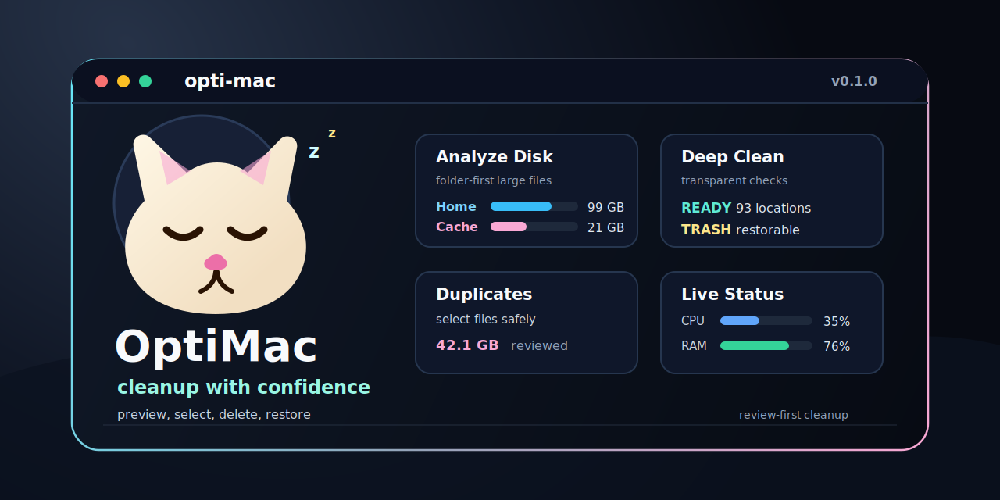

<div align="center">
  
  <h1>OptiMac</h1>
  <p><em>Clean, uninstall, analyze, optimize, and monitor your Mac from the terminal.</em></p>
</div>

<p align="center">
  <a href="https://github.com/luceid/opti-mac/stargazers"></a>
  <a href="./VERSION"></a>
  <a href="./LICENSE"></a>
  <a href="#requirements"></a>
  <a href="./CHANGELOG.md"></a>
</p>

<p align="center">
  
</p>

OptiMac is a CLI-first macOS maintenance tool with an interactive terminal UI. It combines cleanup previews, disk analysis, duplicate review, app uninstall planning, RAM optimization, and live system status in one small Go binary.

> Status: early open-source release. OptiMac is intentionally conservative: destructive commands preview first, protected paths are refused, and high-risk removals use explicit confirmation.

## Features

- **All-in-one toolkit**: Clean, inspect, uninstall, optimize, and monitor from one terminal UI.
- **Transparent cleanup**: Shows checked targets, item counts, reclaimable size, skipped paths, and failures.
- **Deep clean mode**: Cleans user caches, logs, temp files, app state, developer caches, and sudo-only targets when requested.
- **Disk analyzer**: Starts with folder/category overview, then lets you explore large files and delete selected items.
- **Duplicate review**: Detects exact-content duplicates and similar-name groups, with per-file selection before removal.
- **Smart uninstaller**: Lists installed apps by size, previews leftovers, and blocks protected system apps.
- **Live dashboard**: Shows health, CPU, memory, disk, power, processes, network, and an animated cat mascot.
- **Restorable operations**: Trash-backed operations are logged and can be restored by operation ID.

## Requirements

- macOS
- Go for development builds
- `asdf` for the pinned local toolchain
- Optional: Homebrew for packaged installation after release

## Quick Start

**Build from source**

```bash
git clone https://github.com/luceid/opti-mac.git
cd opti-mac
asdf install
make build
./bin/opti-mac
```

**Local install**

```bash
make install
opti-mac version
```

This installs the binary to `~/.local/bin/opti-mac`.

**Homebrew**

A formula template is available at [packaging/homebrew/opti-mac.rb](./packaging/homebrew/opti-mac.rb). After a release archive and SHA256 are published:

```bash
brew install luceid/tap/opti-mac
```

## Run

```bash
opti-mac                         # Interactive terminal menu
opti-mac scan                    # Safe summary scan
opti-mac clean                   # Preview cleanup targets
opti-mac clean --execute         # Clean approved user targets
opti-mac clean --execute --sudo  # Include sudo-only system targets
opti-mac analyze ~/Downloads     # Find large files
opti-mac duplicates ~/Downloads  # Find exact and similar-name duplicates
opti-mac apps                    # List installed apps by size
opti-mac uninstall "App Name"    # Preview app removal and leftovers
opti-mac optimize --ram --sudo   # Purge inactive memory
opti-mac status                  # System health dashboard
opti-mac doctor                  # Read-only security/capacity check
```

## Preview Safely

```bash
opti-mac clean
opti-mac clean --json
opti-mac analyze ~/Downloads --limit 50 --min-size 100MB
opti-mac duplicates ~/Downloads --min-size 1B
opti-mac uninstall "App Name"
opti-mac browser chrome
opti-mac artifacts . --min-size 10MB
opti-mac log
```

Commands that remove data require `--execute` or a TUI confirmation. Large-file and duplicate deletion in the TUI moves selected files to OptiMac trash by default.

## Safety Design

OptiMac is a local system maintenance tool. Some commands can remove local files, so the defaults stay review-first.

| Area | Default behavior |
| --- | --- |
| `clean` | Dry run unless `--execute` is passed. Regenerable caches are deleted permanently by default so space is actually freed. Use `--trash` to keep a restore point. |
| `clean --sudo` | Requires `--execute` and uses macOS admin authorization for sudo-only cache/temp targets. |
| Large files | TUI deletion is selection-based and trash-backed. |
| Duplicates | TUI deletion is per-file selection-based, keeps at least one file per group, and supports trash/permanent mode. |
| `uninstall`, `browser`, `artifacts` | Trash-backed by default unless `--no-trash` is passed. |
| Protected paths | Refuses broad roots such as `/`, `/System`, `/Library`, `/Applications`, `/Users`, the home directory itself, and key user folders. |

Trash-backed operations are stored under:

```text
~/.opti-mac/trash
```

Restore or empty them with:

```bash
opti-mac log
opti-mac restore <operation-id>
opti-mac trash status
opti-mac trash empty
```

Security policy and contribution guardrails live in [SECURITY.md](./SECURITY.md) and [CONTRIBUTING.md](./CONTRIBUTING.md). Pull requests run `make security` to block unapproved external links, remote shell execution patterns, hidden network clients, credential-capture markup, and unreviewed admin prompts.

## Interactive TUI

```bash
opti-mac
```

Common shortcuts:

```text
j / down       move down
k / up         move up
g / G          jump top / bottom
enter          open, run, or go back from a result
esc / b        back
pgup / pgdown  page scroll
q              quit
```

Analyze Disk:

```text
enter   explore selected location
s       cycle sort: category, size, path, modified
[ / ]   previous / next folder category
space   select file
a       select all
d       delete selected files through OptiMac trash
r       refresh overview
```

Duplicates:

```text
s       cycle group sort
[ / ]   previous / next match type or group
space   select group or file
a       select all except first
o       select older copies
n       select copy/final/backup-style names
p       toggle trash/permanent mode
d       delete selected files
```

## Feature Details

### Deep Cleanup

```bash
$ opti-mac clean

Dry run. Re-run with --execute to delete these files.
Checked targets:
  cache              checked, 120 items, 2.4 GB  ~/Library/Caches
  logs               checked, 44 items, 380 MB   ~/Library/Logs
  developer-cache    checked, 89 items, 8.1 GB   ~/Library/Developer

Potential cleanup: 10.8 GB across 253 items
```

For deeper cleanup:

```bash
opti-mac clean --execute --sudo
```

### Disk Analyzer

```bash
$ opti-mac analyze ~/Downloads --limit 10 --min-size 100MB

    3.5 GB  /Users/you/Downloads/screen-recording.mov
    1.8 GB  /Users/you/Downloads/database-backup.dump
  759.2 MB  /Users/you/Downloads/installer.zip
```

The TUI provides a richer category-first view with selection and trash-backed deletion.

### Duplicate Review

```bash
$ opti-mac duplicates ~/Downloads

2.4 GB exact duplicate in 2 files
  /Users/you/Downloads/archive.zip
  /Users/you/Downloads/archive copy.zip

820 MB similar name group in 3 files
  /Users/you/Downloads/report-final.pdf
  /Users/you/Downloads/report-final-copy.pdf
  /Users/you/Downloads/report-final-old.pdf
```

The interactive duplicate view lets you choose exactly which files to delete.

### Smart App Uninstaller

```bash
$ opti-mac apps

    4.2 GB  Xcode                            com.apple.dt.Xcode
    1.8 GB  Docker                           com.docker.docker
  540.2 MB  Linear                           com.linear
```

Preview removal first:

```bash
opti-mac uninstall "Docker"
opti-mac uninstall "Docker" --execute
```

### Live System Status

```bash
$ opti-mac status

Status  Health ● 91 All clear
MacBook Air · M4 · 16.0 GB/460.4 GB · macOS 26.3.1 · up 3d 6h

                         /\_/\
                       =( -.- )=  zZ
                        /|   |\
                         m   m

◉ CPU                                      ◫ Memory
Total  █████░░░░░░░░░░░  35.0%             Used   █████████████░░░  82.9%
Load   1.12 / 1.24 / 1.30                  Free   ██░░░░░░░░░░░░░░  17.1%
```

In the live TUI dashboard, the cat changes pose on refresh.

### Machine-Readable Output

Most read-oriented commands support `--json`:

```bash
opti-mac scan --json
opti-mac clean --json
opti-mac analyze ~/Downloads --json
opti-mac duplicates ~/Downloads --json
opti-mac apps --json
opti-mac status --json
opti-mac doctor --json
```

## Configuration

OptiMac reads:

```text
~/.config/opti-mac/config.json
```

Create a default config:

```bash
opti-mac config init
```

Example:

```json
{
  "use_trash": true,
  "extra_clean_targets": [
    {
      "path": "~/Library/Caches/com.example.app",
      "kind": "cache",
      "category": "custom"
    }
  ],
  "exclude_paths": ["~/Library/Caches/keep-this"]
}
```

## Development

```bash
asdf install
make test
make build
./bin/opti-mac version
```

Useful targets:

```bash
make build
make test
make install
make clean
```

Version is tracked in [VERSION](./VERSION) and injected at build time:

```bash
make build VERSION=0.1.1
```

## Release Checklist

1. Update [VERSION](./VERSION).
2. Add a new entry in [CHANGELOG.md](./CHANGELOG.md).
3. Run `make test` and `make build`.
4. Tag the release, for example `v0.1.1`.
5. Publish the archive and checksum.
6. Update the Homebrew formula URL and SHA256.

## Contributing

Issues and pull requests are welcome. For changes that remove data, include:

- The exact safety behavior.
- Whether the operation is preview, trash-backed, or permanent.
- Tests for protected path handling and failure cases.
- Notes about whether sudo/admin authorization is required.

Before opening a PR:

```bash
make test
make build
```

## License

OptiMac is open source under the MIT License. See [LICENSE](./LICENSE).
